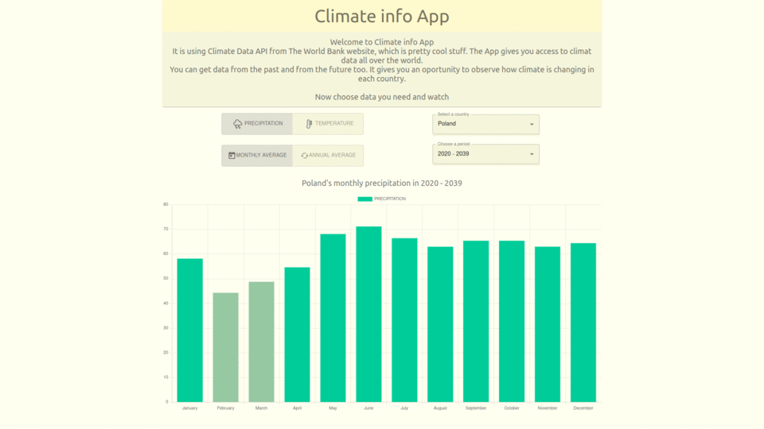

# Climate info App
Climate info App is React JS web app. It is using Climate Data API from The World Bank website. The App gives an access to climate data all over the world. User can get climate data from the past and from the future. It gives an opportunity to observe how climate is changing in each country.

You can find it here:
https://werthis.github.io/ClimateInfoApp/

There is a problem with loading data beacause The World Bank's Data is not using encryption and githuba is. (http and https)

## `react`, `material-ui`, `react-chartjs-2`

