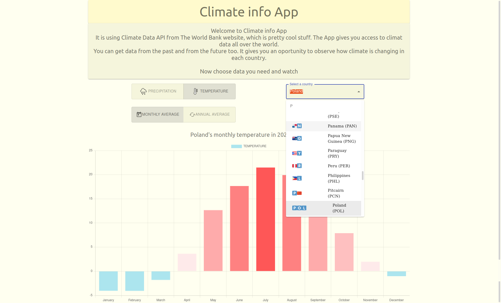
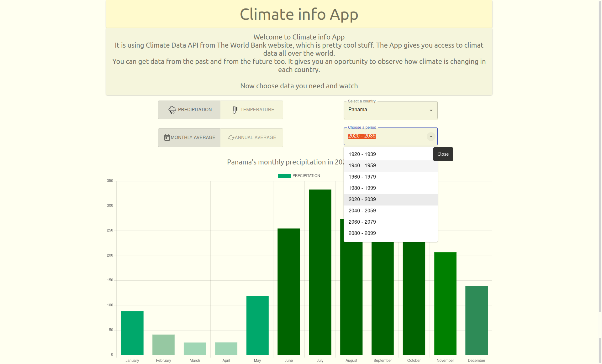

# Climate info App
Climate info App is React JS web app. It is using Climate Data API from The World Bank website. The App gives an access to climat data all over the world.
User can get climate data from the past and from the future. It gives an oportunity to observe how climate is changing in each country.

## `react`, `material-ui`, `react-chartjs-2`

